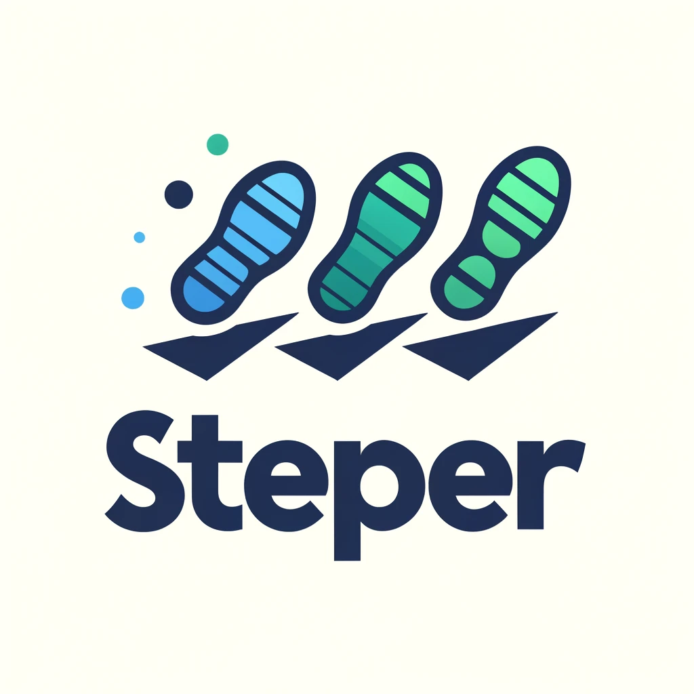

# Steper

A lightweight JavaScript library for draggable and slider animations.



[Demo Examples](https://steper.netlify.app/)

## Installation

```bash
npm install steper
```

## Usage

````html
<ul id="slider">
  <li> slide 1 </li>
  <li> slide 2 </li>
  <li> slide 3 </li>
</ul>
<nav>
  <button id="left">left</button>
  <button id="left">right</button>
</nav>
<script>
import { useDraggableAnimation, useSliderAnimation } from 'steper';

const steperRef = document.getElementById('slider')

//make it draggable
useDraggableAnimation(steperRef);

// and or slide it
const move = useSliderAnimation(steperRef);
// to left
document.getElementById('left').addEventListener('click', () => move(-1))
// to right
document.getElementById('right').addEventListener('click', () => move(1))


</script>
````


## API

### useDraggableAnimation(ref, onDragStart, onDragEnd)
* `ref`: The reference to the HTML element.
* `onDragStart`: Callback function when dragging starts.
* `onDragEnd`: Callback function when dragging ends.

### useSliderAnimation(ref, duration, onSlideStart, onSlideEnd)
* `ref`: The referenceC to the HTML element.
* `duration`: Duration of the slide animation in seconds.
* `onSlideStart`: Callback function when sliding starts.
* `onSlideEnd`: Callback function when sliding ends.

## License

MIT